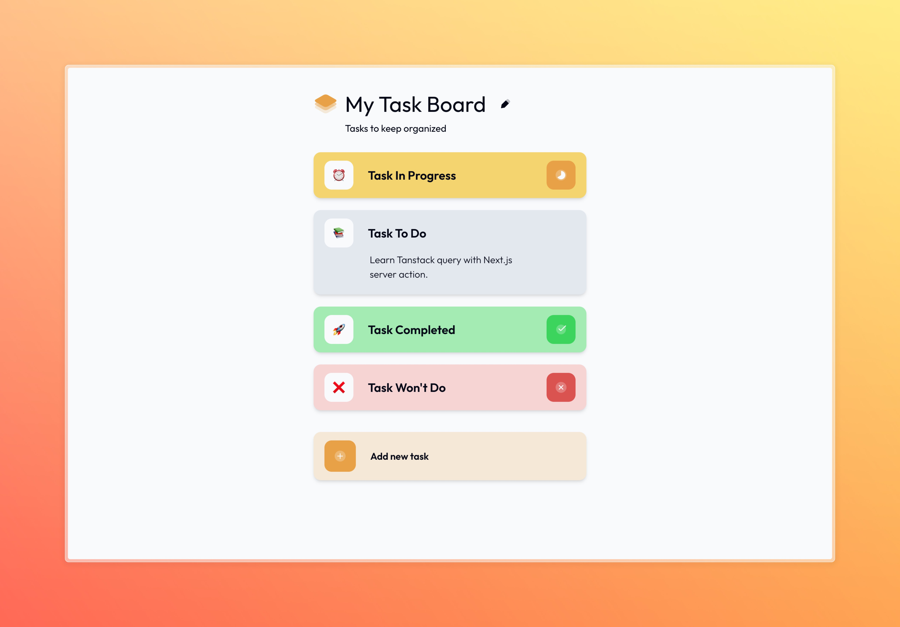

# TASK BOARD

**Link:** https://task-board-tanstack.vercel.app



## Project Purpose

A full-stack task management application demonstrating CRUD operations with modern web technologies. The project focuses on implementing core HTTP methods while providing a clean, intuitive interface for task management.

## Tech Stack

-  **Frontend**: Next.js, TypeScript, Tailwind CSS
-  **State Management**: Tanstack Query
-  **Forms**: React Hook Form
-  **Backend**: Next.js Server Actions
-  **Database**: Prisma ORM with Supabase PostgreSQL
-  **Deployment**: Vercel

## Key Features

### Board Management

-  Create new boards with unique URLs
-  Edit board name and description
-  Shareable board links
-  View board statistics
-  Delete board

### Task Operations

-  Add new tasks with default values
-  Edit task name, description, icon and status
-  Delete tasks
-  Task sorting by status

### Technical Features

-  Real-time data synchronization
-  Form validation and error handling
-  Responsive design

## Development Process

1. **Initial Setup**

   -  Next.js app scaffolding
   -  Prisma ORM configuration with Supabase
   -  Tailwind CSS configuration

2. **Core Implementation**

   -  Board and task data models
   -  CRUD API endpoints via Server Actions
   -  Form components with validation
   -  State management with Tanstack Query

3. **UI/UX Enhancements**

   -  Responsive layout adjustments
   -  Loading states and error handling
   -  Clipboard copy functionality for board URLs

4. **Testing & Deployment**
   -  Manual testing of all CRUD operations
   -  Vercel deployment configuration
   -  Performance optimization

## How to Run Locally

```bash
git clone https://github.com/enggar77/task-board-next-tanstack.git
cd task-board-next-tanstack
npm install
npm run dev
```
